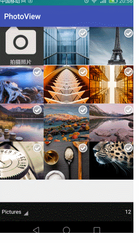
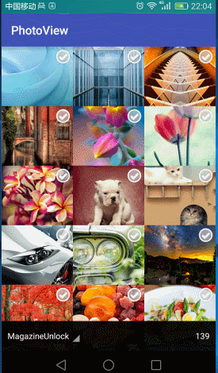
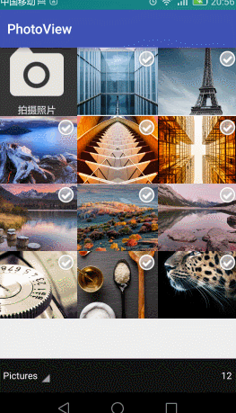

## 效果
### 多选显示相机

### 多选不显示相机

### 单选显示相机

### 单选不显示相机

## 照片选择器

    /**
    是否显示相机，默认显示
     */
    private boolean mIsShowCAMERA =true;

    /**
     * 是否为单选，默认为多选
     */
    private boolean mIsRadio=false;
    /**
     * 选中的照片保存在集合里，单选与多选共用，在点击是判断是单选还是多选
     */
    private ArrayList<String> mSelectedImage = new ArrayList<>();
    